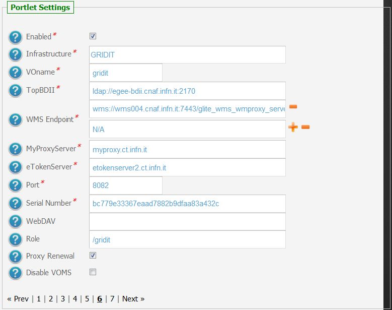
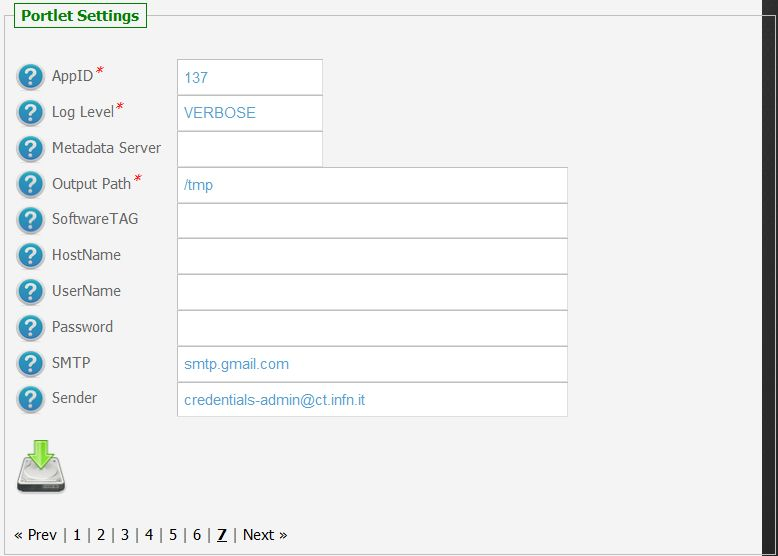
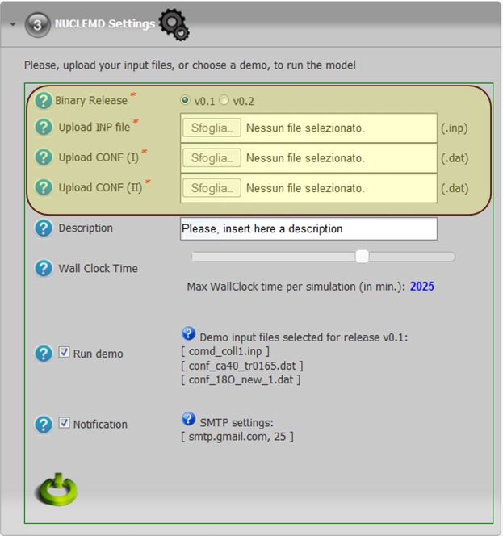

*********************
NUCLEMD
*********************

============
About
============

NUCLEMD is a computer code based on the Constrained Molecular Dynamics model. The peculiarity of the algorithm consists on the isospin dependence of the nucleon-nucleon cross section and on the presence of the Majorana Exchange Operator in the nucleon-nucleon collision term.

The code will be devoted to the study of Single and Double Charge Exchange processes in nuclear reactions at low and intermediate energies.

The aim is to provide theoretical support to the experimental results of the DREAMS collaboration obtained by means of the |MAGNEX| spectrometer.

============
Installation
============
To install this portlet the WAR file has to be deployed into the application server.

As soon as the portlet has been successfully deployed on the Science Gateway the administrator has to configure:

- the list of e-Infrastructures where the application can be executed;

- some additional application settings.

1.) To configure a generic e-Infrastructure, the following settings have to be provided:

**Enabled**: A true/false flag which enables or disable the generic e-Infrastructure;

**Infrastructure**: The acronym to reference the e-Infrastructure;

**VOName**: The VO for this e-Infrastructure;

**TopBDII**: The Top BDII for this e-Infrastructure;

**WMS Endpoint**: A list of WMS endpoint for this e-Infrastructure (max. 10);

**MyProxyServer**: The MyProxyServer for this e-Infrastructure;

**eTokenServer**: The eTokenServer for this e-Infrastructure;

**Port**: The eTokenServer port for this e-Infrastructure;

**Serial Number**: The MD5SUM of the robot certificate to be used for this e-Infrastructure;

In the following figure is shown how the portlet has been configured to run simulation on the Italian e-Infrastructure.

2.) To configure the application, the following settings have to be provided:

**AppID**: The ApplicationID as registered in the UserTracking MySQL database (GridOperations table);

**Software TAG**: The list of software tags requested by the application;

**SMTP Host**: The SMTP server used to send notification to users;

**Sender**: The FROM e-mail address to send notification messages about the jobs execution to users;

.. _1: http://science-gateway.chain-project.eu
.. _CHAIN_REDS: http://www.chain-project.eu/

In the figure below is shown how the application settings have been configured to run on the CHAIN_REDS_ Science Gateway [1_].

============
Usage
============

To run the simulations the user has to:

- click on the *third* accordion of the portlet,

- select the binary release

- upload the input files OR use the pre-configured demo ones, and

- select the Max Wall Clock Time (WCT) requested for the execution as shown in the below figure:

Each simulation will produce:

- *std.out*: the standard output file;

- *std.err*: the standard error file;

- *nuclemd.log*: the NUCLEMD log file;

- *.tar.gz*: containing the NUCLEMD output results.

A typical simulation produces, at the end, the following files:

.. code:: bash

        ]$ tree NUCLEMDSimulationStarted_1826/
        NUCLEMDSimulationStarted_1826/
        ├── std.err
        ├── std.out
        ├── output.README
        ├── nuclemd.log
        └── results.tar.gz

The list of files produced during the run are the following:

.. code:: bash

        ]$ tar ztvf results.tar.gz
        18O40Ca_out
        18O40Ca_t_out
        fort.6
        output.README
        POT.DAT
        rp_out_runco.conf
        seed_dat_runco.conf

============
Contact
============
Please feel free to contact us any time if you have any questions or comments.

.. _INFN: http://www.ct.infn.it/
.. _INFN_LNS: http://www.lns.infn.it/

:Authors:
 
 `Roberto BARBERA <mailto:roberto.barbera@ct.infn.it>`_ - Italian National Institute of Nuclear Physics (INFN_),

 `Gianluca GIULIANI <mailto:gianluca.giuliani1@gmail.com>`_ - Italian National Institute of Nuclear Physics - LNS (INFN_LNS_),
 
 `Giuseppe LA ROCCA <mailto:giuseppe.larocca@ct.infn.it>`_ - Italian National Institute of Nuclear Physics (INFN_),
 
